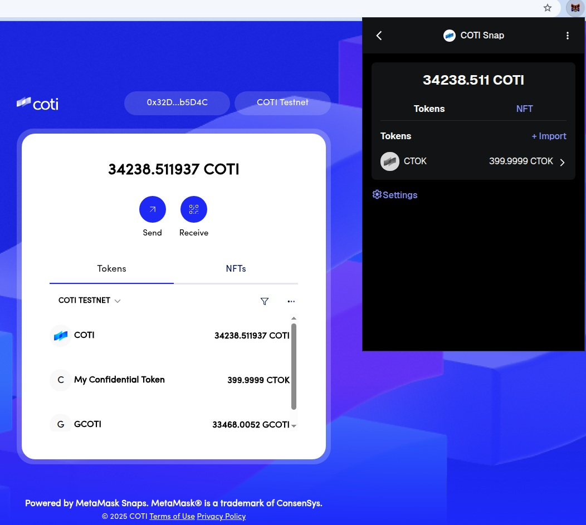

<p align="center">
    
    <br>
</p>

# COTI Snap

The COTI Snap allows users to onboard their COTI account, add and view balances for encrypted private tokens on the COTI network, and interact with COTI dapps.

## Usage

Visit https://docs.coti.io/coti-documentation/build-on-coti/tools/coti-metamask-snap for usage details.

## Development

### Metamask Flask
To interact with COTI Snap, you will need to install [MetaMask Flask](https://metamask.io/flask/), a canary distribution for developers that provides access to upcoming features.

> [!IMPORTANT]  
> You cannot have other versions of MetaMask installed

### Running

1. Clone the COTI-snap repository and set up the development environment:

    ```shell
    yarn install
    yarn start
    ```

    This will start the companion dapp on http://localhost:8000

2. To install the COTI snap and onboard your account, follow the prompts on the companion dapp GUI.

### dApp Integration Guide

See https://docs.coti.io/coti-documentation/build-on-coti/tools/coti-metamask-snap for a detailed integration guide.

### Testing and Linting

Run `yarn test` to run the tests once.

Run `yarn lint` to run the linter, or run `yarn lint:fix` to run the linter and

fix any automatically fixable issues.

## Support

Contact us on the [#developers](https://discord.com/channels/386571547508473876/1008682215619698708) channel in Discord for questions/support.
