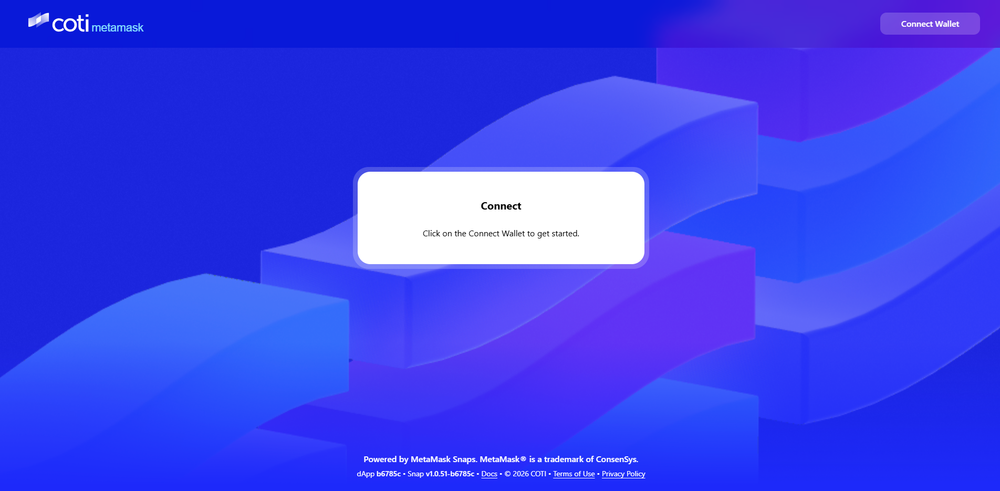
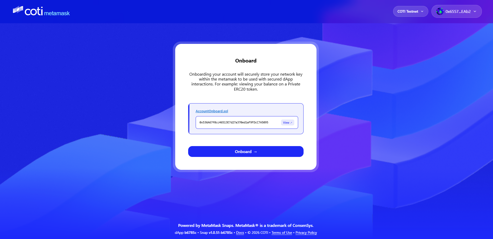
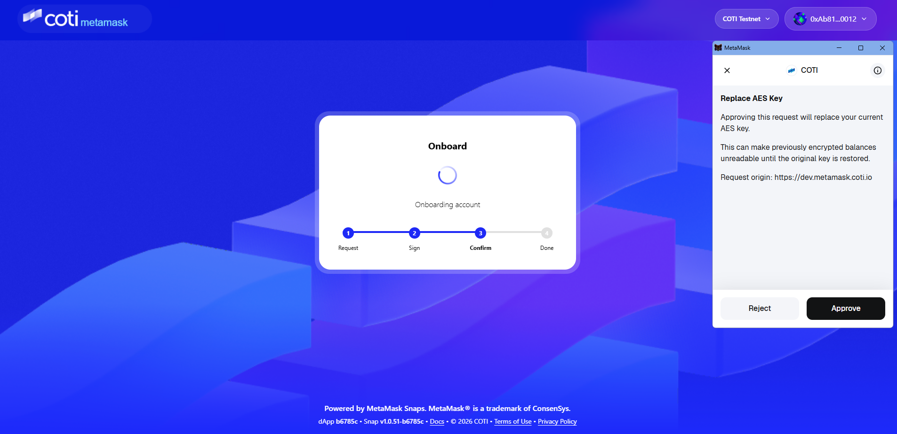
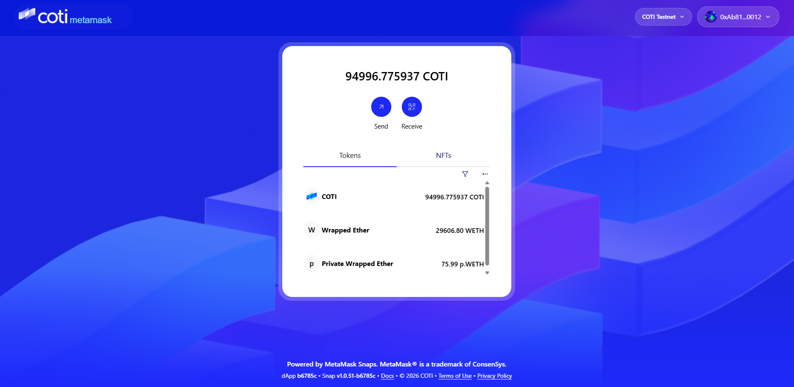
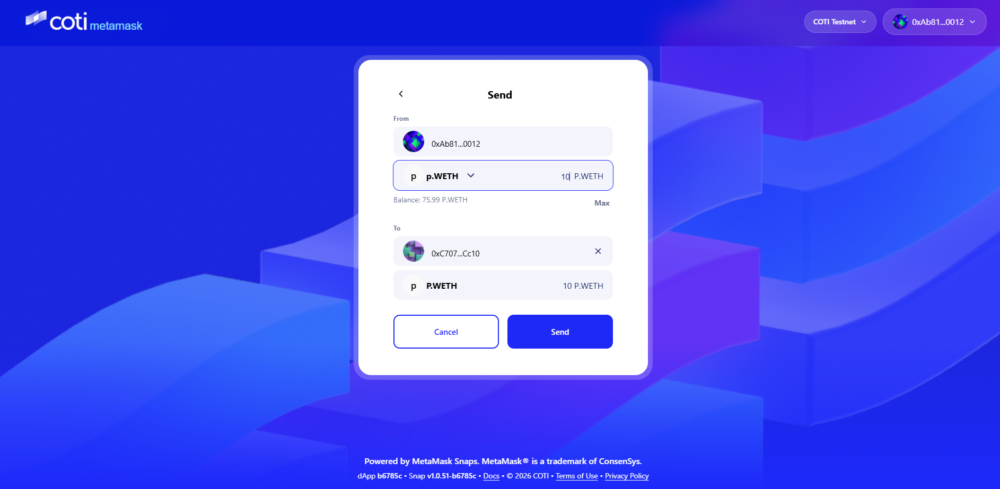
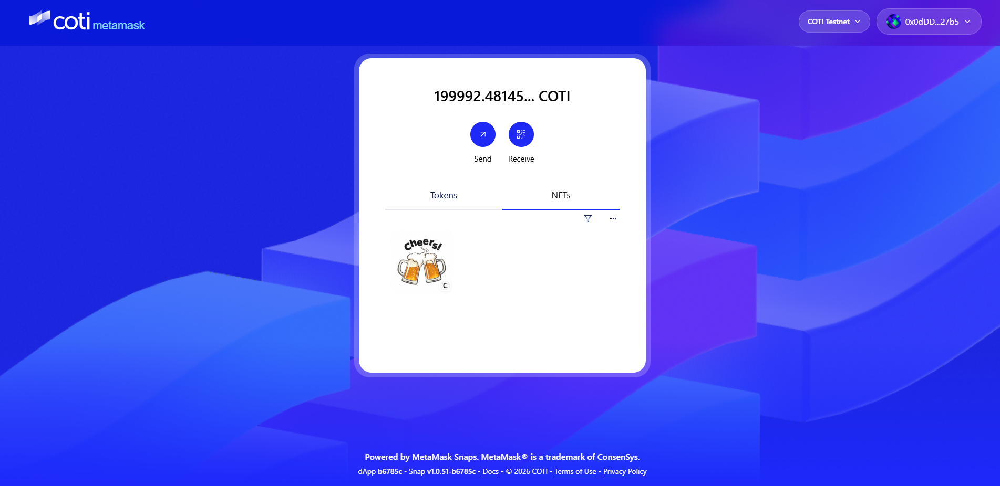

[](https://coti.io/)
[](https://telegram.coti.io)
[](https://discord.coti.io)
[](https://twitter.coti.io)
[](https://youtube.coti.io)

# COTI Snap

[](https://snaps.metamask.io/)
[](https://metamask.coti.io/wallet)
[](https://dev.metamask.coti.io)
[](https://docs.coti.io/coti-documentation/build-on-coti/tools/coti-metamask-snap)

The COTI Snap allows users to onboard their COTI account, add and view balances for encrypted private tokens on the COTI network, and interact with COTI dapps.

## Major features

- **AES key management**: Generate, store, retrieve, and delete the user AES key in MetaMask’s secure storage.
- **Confidential tokens**: View and manage confidential ERC-20 token balances.
- **Confidential NFTs**: Display confidential NFTs (including safe fallbacks when metadata is missing).
- **Private transfers**: Sign and submit private transfers directly from the Snap (MetaMask no longer exposes `eth_sign`).
- **dApp integration**: Simple RPC interface for apps to check permissions, connect, encrypt/decrypt, and manage keys.

## Screenshots

> [!NOTE]
> The screenshots below should reflect the latest UI on `https://dev.metamask.coti.io`.

- **Companion dApp (Install / Connect)**

  

- **Onboarding**

  

- **AES key setup**
  
  

- **Token list / balances**
  
  

- **Transfer flow**
  
  

- **NFT view**
  
  

## Usage

Visit [docs.coti.io/coti-documentation/build-on-coti/tools/coti-metamask-snap](https://docs.coti.io/coti-documentation/build-on-coti/tools/coti-metamask-snap) for usage details.

## Development

### Metamask Flask

To interact with COTI Snap, you will need to install [MetaMask Flask](https://metamask.io/flask/), a canary distribution for developers that provides access to upcoming features.

> [!IMPORTANT]  
> You cannot have other versions of MetaMask installed

### Private 256-bit Transfers (MetaMask)

MetaMask no longer exposes `eth_sign`, so private 256-bit transfers are signed inside the COTI Snap. The first private transfer will prompt for key access (BIP-44 entropy) so the Snap can produce a raw 32-byte signature.

Steps:
1. Install/enable the COTI Snap.
2. Approve the key access prompt when asked.
3. Retry the transfer.

## 📋 Quick Setup

### For Development (Testnet)

```bash
# In packages/site/.env.local
VITE_NODE_ENV=local
VITE_SNAP_ENV=local
VITE_SNAP_VERSION=*
```

### For Production (Mainnet)

```bash
# In packages/site/.env.local
VITE_NODE_ENV=production
VITE_SNAP_ENV=production
VITE_SNAP_VERSION=latest
```

### Running

1. Clone the COTI-snap repository and set up the development environment:

   ```shell
   yarn install
   yarn start
   ```

   This will start the companion dapp on http://localhost:8000

2. To install the COTI snap and onboard your account, follow the prompts on the companion dapp GUI.

### Companion dApp URLs

- **Production**: `https://metamask.coti.io/wallet`
- **Testnet / dev**: `https://dev.metamask.coti.io`

### dApp Integration Guide

See [docs.coti.io/coti-documentation/build-on-coti/tools/coti-metamask-snap](https://docs.coti.io/coti-documentation/build-on-coti/tools/coti-metamask-snap) for a detailed integration guide.

### Testing and Linting

Run `yarn test` to run the tests once.

Run `yarn lint` to run the linter, or run `yarn lint:fix` to run the linter and

fix any automatically fixable issues.

## Support

Contact us on the [#developers](https://discord.com/channels/386571547508473876/1008682215619698708) channel in Discord for questions/support.
